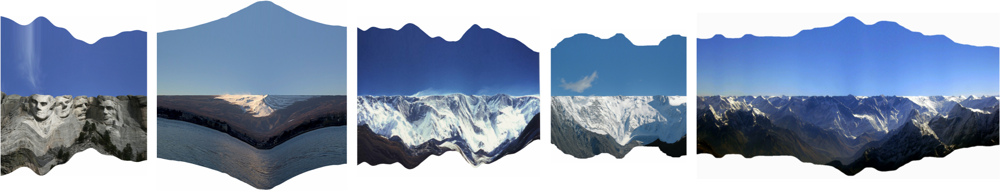
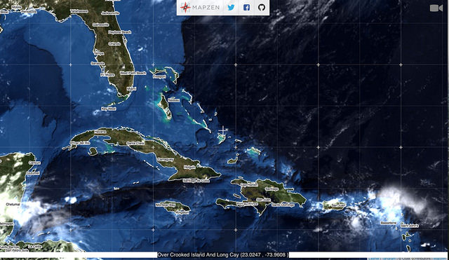

Patricio Gonzalez Vivo

[patricio.io](http://patricio.io) | [@patriciogv](https://twitter.com/patriciogv)

Note:
My name is Patricio.

--

[**Efecto Mariposa** (Butterfly effect)](http://patriciogonzalezvivo.com/2011/efectomariposa/)

Note:
I'm an artist... 

--

**Flatline**

Note:
...interested in landscape

--

[**Skyline I**](http://patriciogonzalezvivo.com/2014/skylines/skylines.php?v=01)

--

[**Skyline II**](http://patriciogonzalezvivo.com/2014/skylines/skylines.php?v=02)

--

[**Skyline III**](http://patriciogonzalezvivo.com/2014/skylines/skylines.php?v=03)

Note:
width a passion for shaders. 

--

**patricio**.io

Note:
You can find more about them in my site
patricio.io

--

@**patriciogv**

Note:
or follow me at patriciogv

---

[mapzen.com](http://mapzen.com) | [@mapzen](https://twitter.com/mapzen)

Note:
I have the priviledge of be part of an amazing team of profesionals at Mapzen.

--

 

[Experiments on **3D Labels** (C++)](https://vimeo.com/107190391)

Note:
I work as a graphic engineer, pushing the limits of our tools. I have work on experiments like this 3D labels

--

   

[Experiment on LIDAR + SfM + OpenStreetMap (Python/C++)](https://mapzen.com/blog/point-clouds)

Note:
or this experiment about mixing LIDAR data with Structure from Motion point clouds from images with openStreetMap data.

--

 

 

[Tangram styles (WebGL)](patriciogonzalezvivo.github.io/tangram-sandbox/)

--

 

 

<!-- .slide: data-background="#000000" -->
[Tangram styles (WebGL)](patriciogonzalezvivo.github.io/tangram-sandbox/)

--

 

 

<!-- .slide: data-background="#000000" -->
[Tangram styles (WebGL)](patriciogonzalezvivo.github.io/tangram-sandbox/)

--

<!-- .slide: data-background="#020513" -->
 

[ISS from OSM](http://patriciogonzalezvivo.github.io/ISS/)

--

<!-- .slide: data-background="#020303" -->

  

[Line of Sight](http://patriciogonzalezvivo.github.io/LineOfSight/)

--

Terrarium experiments

--

Terrarium experiments

--

**mapzen**.com

Note:
You can find more about Mapzen in mapzen.com
All our work is 100% open source and all our services are free. So sign up for API keys, we will be glad to help and assist you on using them.

--

@**mapzen**

Note:
also you can follow us at @mapzen
So... all that maps that I just show are made with shaders.

--

# I ♥ 

##GLSL

Note:
All this work that I show have one or another way shaders
I love them