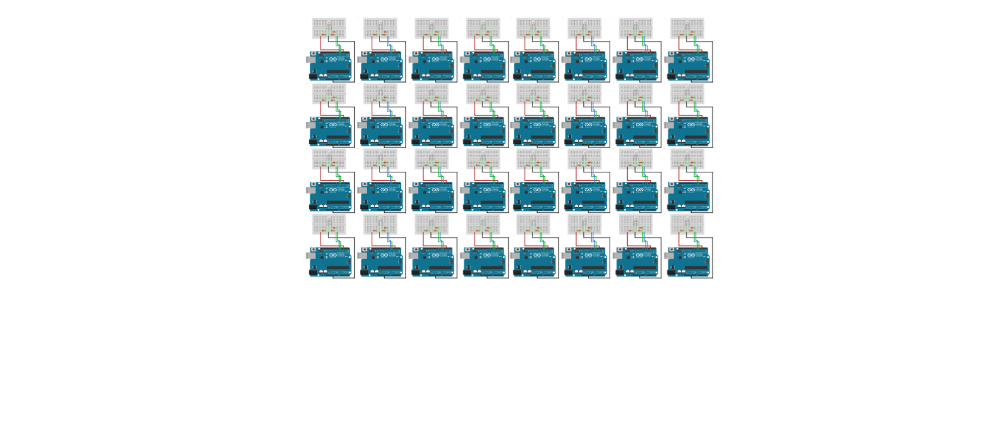

What's a **shader?**

Note:
Enought of introductions... What's a shader?

--


---

<iframe class='fit' width='100%' height='100%' data-src='http://thebookofshaders.com'></iframe>

Note:
One year ago I start a long time project call The book of shaders, my goal with it is to explain what shader are and how they work.
I'm going to use some of the **material** I use in the book to explain what they are but I highly encorage everybody interested on this subject to take a look to it.

---

```glsl
uniform vec2 u_resolution;
uniform vec2 u_mouse;
uniform float u_time;

void main() {
    vec2 st = gl_FragCoord.xy/u_resolution.xy;
    st.x *= u_resolution.x/u_resolution.y;

    st += vec2(.0);
    vec3 color = vec3(1.);
    color = vec3(st.x,st.y,abs(sin(u_time)));

    gl_FragColor = vec4(color,1.0);
}
```

Note:
Shaders are small “C-like” programs that **executed a main single function in parallel**. Most of the cases they **compute single operations like position of vertices or the color of a pixel**.

--


Note:
Shaders are for graphic developer, what the **Gutenberg Press** was for books authors.

--


Note:
They free us from the **single threated hand of the CPU** with the **multiple parallel process** to do one frame per cycle.
Let's picture it like this...

--


**CPU**

Note:
Imagine this is your CPU. It's preatty great to do all sort of things. Excecutes complex task one after the other one.
But what about a huge stream of very tiny tinsy small task... for example computing information to display in the screen.
It need to calculate every single pixels of it 

--

800x600 px = 
**480,000** <!-- {_class="fragment"} -->

at 60 mHz <!-- {_class="fragment"} -->
is **28,800,000** <!-- {_class="fragment"} -->

--

2560x1600 px = 
**4,096,000** <!-- {_class="fragment"} -->

at 60 mHz <!-- {_class="fragment"} -->
is **245,760,000** <!-- {_class="fragment"} -->

--


sad **CPU**

Note:
So... this is obviusly inviable.
Closely 16 year ago graphic engeneers find a salution to this particular problem.
Using parallel procesors. Small procesors...

--


**GPU**

Note:
Little pipes very dummy. One next to each other... working independelty.
Like water in **strainer**... the stream of task pass through them.
To picture in this other way.
Each small tube... is very small procesador. that runs a C-like program

--


Note:
Like an arduino

--


Note:
Well more like handreds of arduinos. 
Well you have to imagine better than that... that's only 72 of them.
Imagine that you can flash them all at once with the same firmware.

--


Note:
Each one of them is connected to a single RGB Led and is responsable of computer the color that LED.

--



<!-- .slide: data-transition="fade" -->
Note:
running in parallel.

--


<!-- .slide: data-transition="fade" -->
Note:
Each one of them responsable for the color of a LED
Imagine the hability to flash them all with a same C program.

--


<!-- .slide: data-transition="fade" -->
Note:
They also have their own memory that all share

--

<!-- .slide: data-transition="fade" -->


Note:
Imagine this happening away from the CPU. In isolation.

We have just imagine the Graphic Computer unit, it's power and some of their limitations. 

---

<!-- .slide: data-background="#36383C" -->
<iframe class='fit' width='100%' height='100%' data-src='editor.html'></iframe>

Note:
This is a single shader. They are atomic and self contain. One **single main function*** execute in parallel for each pixel. Is the Sauron ring of GPUs. 
It have some build in functions like: ```gl_FragCoord``` (read only variable that  provides the position of the pixel on the viewport) and ```gl_FragColor``` (write only variable that contain the color of the pixel);
Then it have some variables that we can 'send' from the CPU that are going to be uniform to all the threats call ```uniforms```. There we are passing the resolution (or dimensions) of the viewport, the mouse position and elipse time. 
