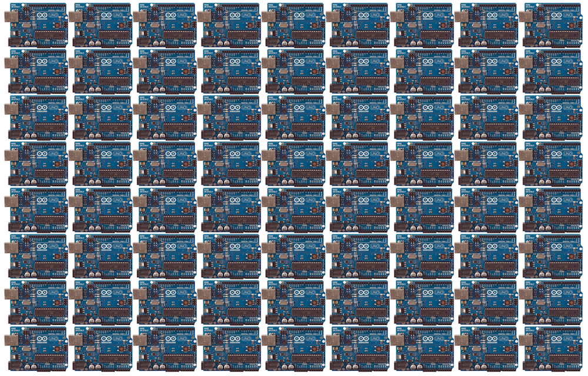

<iframe class='fit' width='100%' height='100%' data-src='http://thebookofshaders.com'></iframe>

Note:
One year ago I start a long time project call The book of shaders, my goal with it is to explain what shader are and how they work. Try to share a little of my pasion for it for it. In it I try to present the concept in an friendly and ?? way. Check it out at...

---

What's a **shader?**

Note:
Let's me give you a quick introduction to shaders from the book...

--

```glsl
uniform vec2 u_resolution;
uniform vec2 u_mouse;
uniform float u_time;

void main() {
    vec2 st = gl_FragCoord.xy/u_resolution.xy;
    st.x *= u_resolution.x/u_resolution.y;

    st += vec2(.0);
    vec3 color = vec3(1.);
    color = vec3(st.x,st.y,abs(sin(u_time)));

    gl_FragColor = vec4(color,1.0);
}
```

Note:
Shaders are small “C-like” programs that are execute in parallel in the graphic cards to compute single operations like the position of vertices or the color of a pixel.

--


Note:
Shaders are for computer graphic what the **Gutenberg Press** was for books.

--


Note:
They free us from the process of making graphics from the single threaten hand of the CPU to speed it up using multiple programable structures that prints one frame in a single cycle.
Let's picture it like this...

--


**CPU**

Note:
Imagine this is your CPU. It's preatty great to do all sort of things. Excecutes complex task one after the other one.
But what about a huge stream of very tiny tinsy small task... for example computing information to display in the screen.
It need to calculate every single pixels of it 

--

800px x 600px = 
**480,000** <!-- {_class="fragment"} -->

at 60 mHz <!-- {_class="fragment"} -->
is **28,800,000** <!-- {_class="fragment"} -->

--

2560x1600 = 
**4,096,000** <!-- {_class="fragment"} -->

at 60 mHz <!-- {_class="fragment"} -->
is **245,760,000** <!-- {_class="fragment"} -->

--


sad **CPU**

Note:
So... this is obviusly inviable.
Closely 16 year ago we find a salution to this particular problem.
Using parallel procesors. Small procesors... like an army of ants

--


Note:
Imagine an arduino

--


Note:
Now imagine millons of arduinos. Well you have to imagine better than that... that's only 72 of them.
Imagine tht you can flash them all at once with the same firmware.

--


Note:
Each one of them is connected to a single RGB Led. That's all they have to do. Computer the color of something.

--


sad **CPU**

Note:
So now this amount of task pass all at once...

--


**GPU**

Note:
From this smaller pipes... like water in strainer.
I guess in this methaphor this are toilet paper tubes... each pixel task is a ping pong ball.
Think on that the next time you are in the bathroom :)
and that's a shader!

---

<!-- .slide: data-background="#36383C" -->
<iframe class='fit' width='100%' height='100%' data-src='http://editor.thebookofshaders.com'></iframe>

Note:
This is a single shader. They are atomic and self contain. One **single main function*** execute in parallel for each pixel. Is the Sauron ring of GPUs. 
It have some build in functions like: ```gl_FragCoord``` (read only variable that  provides the position of the pixel on the viewport) and ```gl_FragColor``` (write only variable that contain the color of the pixel);
Then it have some variables that we can 'send' from the CPU that are going to be uniform to all the threats call ```uniforms```. There we are passing the resolution (or dimensions) of the viewport, the mouse position and elipse time. 
