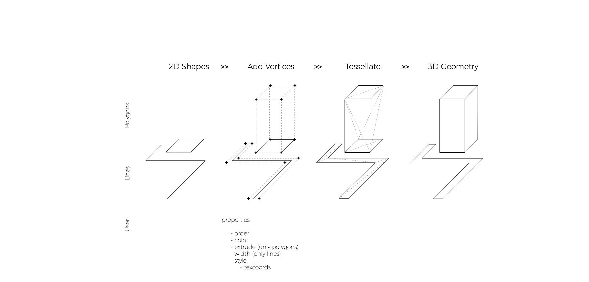
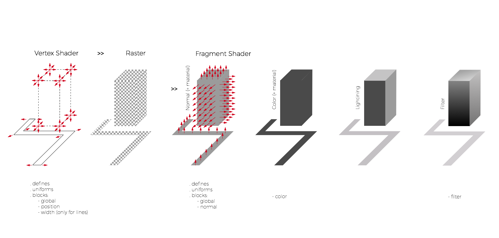
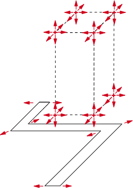
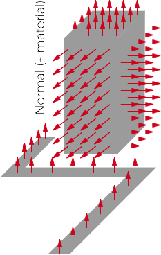
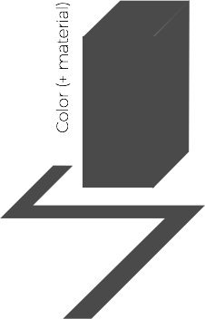
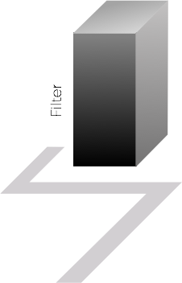

<p style='font-size: 18px; font-style: italic; margin: 0px'>Journey by <strong> The Game Company</strong></p>

Note:
Shaders are use in a lot different situations, like apps and games.
How this apply this...

---

<iframe class='fit' width="100%" height="100%" data-src="http://tangrams.github.io/tangram-sandbox/tangram.html?slides/02-tiles.yaml#2/0/0"></iframe>

Note:
to this?
At Mapzen we made Tangram, a 2D/3D map engine implemented in both OpenGL ES and WebGL.

---

<iframe class='fit' width="100%" height="100%" style='min-height: 1000px;' data-src="http://tangrams.github.io/tangram-sandbox/tangram.html?slides/00-tangram.yaml#15/40.7076/-74.0146"></iframe>

Note:
We start by graving the OSM data, divide into tiles in our servers and extruding the height of the buildings on Tangram.js client.
To then...

--

CPU



**+** [more information about tangram's styles](https://mapzen.com/documentation/tangram/Styles-Overview/)

Note:
This is done in the CPU

---

<!-- .slide: data-background="#1D1D1D" -->

<iframe class='fit' width="100%" height="100%" style='min-height: 1000px;' data-src="http://tangrams.github.io/tangram-sandbox/tangram.html?styles/tilt-gotham#15/40.7076/-74.0146"></iframe>

Note:
we can style them using shaders. :)

It's an interesting **hybrid** engine. Is **cartography tool with extreme flexible capabilities**

Before jumping into the shader aspecto of this maps. Is important to know a little more about Tangam and Mapzen's vector tiles.

--

GPU



**+** [more information about tangram's main shader pipeline](https://mapzen.com/documentation/tangram/Shaders-Overview/)

Note:
While this is done in the GPU

--

[Polygon/Lines main **Vertex** Shader](https://github.com/tangrams/tangram/blob/master/src/styles/polygons/polygons_vertex.glsl)

```glsl
uniform vec2 u_resolution;
uniform float u_time;
uniform vec3 u_map_position;
uniform vec3 u_tile_origin;
uniform float u_meters_per_pixel;
uniform float u_device_pixel_ratio;

uniform mat4 u_model;
uniform mat4 u_modelView;
uniform mat3 u_normalMatrix;

attribute vec4 a_position;
attribute vec4 a_color;

// Optional normal attribute, otherwise default to up
#ifdef TANGRAM_NORMAL_ATTRIBUTE
    attribute vec3 a_normal;
    #define TANGRAM_NORMAL a_normal
#else
    #define TANGRAM_NORMAL vec3(0., 0., 1.)
#endif

// Optional dynamic line extrusion
#ifdef TANGRAM_EXTRUDE_LINES
    // xy: extrusion direction in xy plane
    // z:  half-width of line (amount to extrude)
    // w:  scaling factor for interpolating width between zooms
    attribute vec4 a_extrude;
#endif

varying vec4 v_position;
varying vec3 v_normal;
varying vec4 v_color;
varying vec4 worldPosition();

// Optional texture UVs
#ifdef TANGRAM_TEXTURE_COORDS
    attribute vec2 a_texcoord;
    varying vec2 v_texcoord;
#endif

#if defined(TANGRAM_LIGHTING_VERTEX)
    varying vec4 v_lighting;
#endif

#pragma tangram: camera
#pragma tangram: material
#pragma tangram: lighting
#pragma tangram: global

void main() {
    // Adds vertex shader support for feature selection
    #pragma tangram: feature-selection-vertex

    // Texture UVs
    #ifdef TANGRAM_TEXTURE_COORDS
        v_texcoord = a_texcoord;
    #endif

    // Position
    vec4 position = vec4(SHORT(a_position.xyz), 1.);

    #ifdef TANGRAM_EXTRUDE_LINES
        vec2 extrude = SCALE_8(a_extrude.xy);
        float width = SHORT(a_extrude.z);
        float scale = SCALE_8(a_extrude.w);

        // Keep line width constant in screen-space
        float zscale = u_tile_origin.z - u_map_position.z;
        width *= pow(2., zscale);

        // Smoothly interpolate line width between zooms
        width = mix(width, width * scale, -zscale);

        // Modify line width before extrusion
        #pragma tangram: width

        position.xy += extrude * width;
    #endif

    // World coordinates for 3d procedural textures
    worldPosition() = wrapWorldPosition(u_model * position);

    // Adjust for tile and view position
    position = u_modelView * position;

    // Modify position before camera projection
    #pragma tangram: position

    // Setup varyings
    v_position = position;
    v_normal = normalize(u_normalMatrix * TANGRAM_NORMAL);
    v_color = a_color;

    // Vertex lighting
    #if defined(TANGRAM_LIGHTING_VERTEX)
        vec4 color = a_color;
        vec3 normal = TANGRAM_NORMAL;

        // Modify normal before lighting
        #pragma tangram: normal

        // Modify color and material properties before lighting
        #pragma tangram: color

        v_lighting = calculateLighting(position.xyz, normal, color);
        v_color = color;
    #endif

    // Camera
    cameraProjection(position);
    applyLayerOrder(SHORT(a_position.w), position);

    gl_Position = position;
}
```

[Note the injection points defined through ```pragmas```](https://github.com/tangrams/tangram/tree/master/src/gl/shaders)

Note:
In this pragmas we are giving the change to the user to inject code. 

--

[Polygon/Lines main **Fragment** Shader](https://github.com/tangrams/tangram/blob/master/src/styles/polygons/polygons_fragment.glsl)

```glsl
uniform vec2 u_resolution;
uniform float u_time;
uniform vec3 u_map_position;
uniform vec3 u_tile_origin;
uniform float u_meters_per_pixel;
uniform float u_device_pixel_ratio;

varying vec4 v_position;
varying vec3 v_normal;
varying vec4 v_color;
varying vec4 worldPosition();

#ifdef TANGRAM_TEXTURE_COORDS
    varying vec2 v_texcoord;
#endif

#if defined(TANGRAM_LIGHTING_VERTEX)
    varying vec4 v_lighting;
#endif

#pragma tangram: camera
#pragma tangram: material
#pragma tangram: lighting
#pragma tangram: global

void main (void) {
    vec4 color = v_color;
    vec3 normal = v_normal;

    #ifdef TANGRAM_MATERIAL_NORMAL_TEXTURE
        calculateNormal(normal);
    #endif

    // Modify normal before lighting
    #pragma tangram: normal

    // Modify color and material properties before lighting
    #if !defined(TANGRAM_LIGHTING_VERTEX)
    #pragma tangram: color
    #endif

    #if defined(TANGRAM_LIGHTING_FRAGMENT)
        color = calculateLighting(v_position.xyz - u_eye, normal, color);
    #elif defined(TANGRAM_LIGHTING_VERTEX)
        color = v_lighting;
    #endif

    // Modify color after lighting (filter-like effects that don't require a additional render passes)
    #pragma tangram: filter

    gl_FragColor = color;
}
```

[Note the injection points defined through ```pragmas```](https://github.com/tangrams/tangram/tree/master/src/gl/shaders)

Note:
Here is where it get’s interesting to me, you have the ability to inject GLSL code blocks. See this example

---

<!-- .slide: data-background="#26282C" -->

<iframe class='fit' width='100%' height='100%' style='min-height: 1000px;' data-src='https://mapzen.com/tangram/play/?scene=https://rawgit.com/tangrams/tangram-sandbox/gh-pages/styles/default.yaml#16.5541666666667/40.70579/-74.01260'></iframe>

--

Source

```YAML
sources:
    osm:
        type: TopoJSON
        url:  //vector.mapzen.com/osm/all/{z}/{x}/{y}.topojson
 ```
 
 **+** [more information about sources](https://mapzen.com/documentation/tangram/sources/)

Note:
You specify what's your source in a scene yaml file

--

How a **vector-tile** looks like?

```JSON
{
  "boundaries": {
    "type": "FeatureCollection",
    "features": [
    ]
  },
  "buildings": {
    "type": "FeatureCollection",
    "features": [
      {
        "geometry": {
          "type": "Polygon",
          "coordinates": [
            [
              [ -74.0161 , 40.712616 ], [ -74.016041 , 40.712696 ], [ -74.016034 , 40.712693 ], [ -74.015775 , 40.713057 ], [ -74.015071 , 40.712748 ], [ -74.015057 , 40.712786 ], [ -74.01497 , 40.712819 ], [ -74.014872 , 40.712782 ], [ -74.014826 , 40.712717 ], [ -74.01489 , 40.712546 ], [ -74.014812 , 40.712515 ], [ -74.014817 , 40.712501 ], [ -74.014797 , 40.712497 ], [ -74.014805 , 40.712477 ], [ -74.014788 , 40.712474 ], [ -74.014792 , 40.712461 ], [ -74.014775 , 40.712458 ], [ -74.014835 , 40.712296 ], [ -74.014852 , 40.7123 ], [ -74.014856 , 40.712288 ], [ -74.014874 , 40.712291 ], [ -74.01488 , 40.712275 ], [ -74.014903 , 40.71228 ], [ -74.014969 , 40.712101 ], [ -74.014899 , 40.712058 ], [ -74.014992 , 40.711808 ], [ -74.014972 , 40.711804 ], [ -74.014911 , 40.711667 ], [ -74.014991 , 40.711537 ], [ -74.015168 , 40.711488 ], [ -74.01521 , 40.711503 ], [ -74.015292 , 40.711531 ], [ -74.015337 , 40.711547 ], [ -74.015399 , 40.711684 ], [ -74.015314 , 40.711826 ], [ -74.015404 , 40.711857 ], [ -74.015464 , 40.711877 ], [ -74.015366 , 40.712139 ], [ -74.015414 , 40.712149 ], [ -74.015421 , 40.712132 ], [ -74.015465 , 40.71213 ], [ -74.015506 , 40.712133 ], [ -74.015544 , 40.712137 ], [ -74.015586 , 40.712148 ], [ -74.015627 , 40.712165 ], [ -74.015659 , 40.712183 ], [ -74.015652 , 40.712201 ], [ -74.015967 , 40.712269 ], [ -74.015944 , 40.71233 ], [ -74.015951 , 40.712332 ], [ -74.015928 , 40.712395 ], [ -74.015881 , 40.712521 ], [ -74.0161 , 40.712616 ]
            ]
          ]
        },
        "type": "Feature",
        "properties": {
          "roof_material": "concrete",
          "name": "Two World Financial Center",
          "area": 17588,
          "roof_shape": "flat",
          "height": 18,
          "id": 75309461
        }
      },
      {
        "geometry": {
          "type": "Point",
          "coordinates": [ -74.015436 , 40.712272 ]
        },
        "type": "Feature",
        "properties": {
          "label_placement": "yes",
          "roof_material": "concrete",
          "name": "Two World Financial Center",
          "area": 17588,
          "roof_shape": "flat",
          "height": 18,
          "id": 75309461
        }
      },
      {
        "geometry": {
          "type": "Polygon",
          "coordinates": [
            [
              [ -74.016646 , 40.71393 ], [ -74.016165 , 40.7146 ], [ -74.015975 , 40.714513 ], [ -74.015799 , 40.714436 ], [ -74.015804 , 40.714428 ], [ -74.01572 , 40.714392 ], [ -74.015715 , 40.714399 ], [ -74.015582 , 40.714338 ], [ -74.015427 , 40.714265 ], [ -74.015457 , 40.714224 ], [ -74.015428 , 40.714212 ], [ -74.015403 , 40.714139 ], [ -74.015422 , 40.714111 ], [ -74.015398 , 40.714101 ], [ -74.015393 , 40.714108 ], [ -74.015166 , 40.714012 ], [ -74.015171 , 40.714006 ], [ -74.015143 , 40.713995 ], [ -74.015172 , 40.713956 ], [ -74.01516 , 40.713895 ], [ -74.015106 , 40.713873 ], [ -74.015255 , 40.713666 ], [ -74.015309 , 40.713591 ], [ -74.015363 , 40.713516 ], [ -74.01541 , 40.71345 ], [ -74.01544 , 40.71341 ], [ -74.015498 , 40.713431 ], [ -74.01549 , 40.713444 ], [ -74.016352 , 40.713806 ], [ -74.016646 , 40.71393 ]
            ]
          ]
        },
        "type": "Feature",
        "properties": {
          "roof_material": "concrete",
          "name": "Four World Financial Center",
          "area": 15844,
          "roof_shape": "flat",
          "height": 18,
          "id": 277919042
        }
      },
    ]
  },
  "places": {
    "type": "FeatureCollection",
    "features": [
      {
        "geometry": {
          "type": "Point",
          "coordinates": [ -74.016937 , 40.711017 ]
        },
        "type": "Feature",
        "properties": {
          "source": "openstreetmap",
          "kind": "neighbourhood",
          "scalerank": 12,
          "id": 158874315,
          "name": "Battery Park City"
        }
      },
      ...
    ]
  },
  "transit": {
    "type": "FeatureCollection",
    "features": [
      {
        "geometry": {
          "type": "LineString",
          "coordinates": [
            [ -74.014893 , 40.713138 ], [ -74.018627 , 40.713956 ]
          ]
        },
        "type": "Feature",
        "properties": {
          "kind": "subway",
          "network": "PATH",
          "colour": "#ED1B24",
          "route_name": "PATH (Newark-WTC)",
          "operator": "Port Authority of New York and New Jersey",
          "ref": "PATH",
          "id": -1468867,
          "osm_relation": true
        }
      },
      {
        "geometry": {
          "type": "LineString",
          "coordinates": [
            [ -74.020386 , 40.713346 ], [ -74.016713 , 40.712285 ], [ -74.014893 , 40.711757 ]
          ]
        },
        "type": "Feature",
        "properties": {
          "kind": "subway",
          "network": "PATH",
          "colour": "#ED1B24",
          "route_name": "PATH (Newark-WTC)",
          "operator": "Port Authority of New York and New Jersey",
          "ref": "PATH",
          "id": -1468867,
          "osm_relation": true
        }
      },
      {
        "geometry": {
          "type": "LineString",
          "coordinates": [
            [ -74.020386 , 40.713346 ], [ -74.016713 , 40.712285 ], [ -74.014893 , 40.711757 ]
          ]
        },
        "type": "Feature",
        "properties": {
          "kind": "subway",
          "network": "PATH",
          "colour": "#00A750",
          "route_name": "PATH (Hoboken-WTC)",
          "operator": "Port Authority of New York and New Jersey",
          "ref": "PATH",
          "id": -1468847,
          "osm_relation": true
        }
      },
      {
        "geometry": {
          "type": "LineString",
          "coordinates": [
            [ -74.014893 , 40.713138 ], [ -74.018627 , 40.713956 ]
          ]
        },
        "type": "Feature",
        "properties": {
          "kind": "subway",
          "network": "PATH",
          "colour": "#00A750",
          "route_name": "PATH (Hoboken-WTC)",
          "operator": "Port Authority of New York and New Jersey",
          "ref": "PATH",
          "id": -1468847,
          "osm_relation": true
        }
      }
    ]
  },
  "pois": {
    "type": "FeatureCollection",
    "features": [
      {
        "geometry": {
          "type": "Point",
          "coordinates": [ -74.01721 , 40.709816 ]
        },
        "type": "Feature",
        "properties": {
          "kind": "car_sharing",
          "name": "333 Rector Place",
          "id": 1434037224
        }
      }
    ]
  },
  "water": {
    "type": "FeatureCollection",
    "features": [
      {
        "geometry": {
          "type": "Polygon",
          "coordinates": [
            [
              [ -74.017571 , 40.713956 ], [ -74.017635 , 40.713608 ], [ -74.017733 , 40.713081 ], [ -74.017723 , 40.713063 ], [ -74.017706 , 40.713059 ], [ -74.017685 , 40.713062 ], [ -74.017673 , 40.713075 ], [ -74.017578 , 40.713601 ], [ -74.016333 , 40.713413 ], [ -74.016408 , 40.713106 ], [ -74.016476 , 40.713051 ], [ -74.016543 , 40.712983 ], [ -74.016599 , 40.712898 ], [ -74.016634 , 40.712806 ], [ -74.016641 , 40.712714 ], [ -74.016628 , 40.712632 ], [ -74.016603 , 40.712552 ], [ -74.016581 , 40.712492 ], [ -74.016564 , 40.712479 ], [ -74.016634 , 40.712167 ], [ -74.017218 , 40.71226 ], [ -74.017806 , 40.712355 ], [ -74.017722 , 40.712832 ], [ -74.017728 , 40.712844 ], [ -74.017745 , 40.712853 ], [ -74.017766 , 40.71285 ], [ -74.017779 , 40.712837 ], [ -74.017865 , 40.712362 ], [ -74.017989 , 40.711676 ], [ -74.018103 , 40.711075 ], [ -74.018253 , 40.710475 ], [ -74.018407 , 40.709859 ], [ -74.018423 , 40.709792 ], [ -74.020386 , 40.709792 ], [ -74.020386 , 40.713956 ], [ -74.017571 , 40.713956 ]
            ]
          ]
        },
        "type": "Feature",
        "properties": {
          "source": "openstreetmapdata.com",
          "kind": "ocean",
          "area": 1087196416,
          "id": 10125,
          "name": ""
        }
      },
      {
        "geometry": {
          "type": "Polygon",
          "coordinates": [
            [
              [ -74.017571 , 40.713956 ], [ -74.017635 , 40.713608 ], [ -74.017733 , 40.713081 ], [ -74.017723 , 40.713063 ], [ -74.017706 , 40.713059 ], [ -74.017685 , 40.713062 ], [ -74.017673 , 40.713075 ], [ -74.017578 , 40.713601 ], [ -74.016332 , 40.713413 ], [ -74.016408 , 40.713106 ], [ -74.016476 , 40.713051 ], [ -74.016543 , 40.712983 ], [ -74.016599 , 40.712898 ], [ -74.016633 , 40.712806 ], [ -74.01664 , 40.712714 ], [ -74.016628 , 40.712631 ], [ -74.016603 , 40.712552 ], [ -74.016581 , 40.712492 ], [ -74.016564 , 40.712479 ], [ -74.016634 , 40.712168 ], [ -74.017218 , 40.71226 ], [ -74.017806 , 40.712355 ], [ -74.017722 , 40.712832 ], [ -74.017727 , 40.712844 ], [ -74.017745 , 40.712853 ], [ -74.017766 , 40.71285 ], [ -74.017779 , 40.712837 ], [ -74.017864 , 40.712362 ], [ -74.017989 , 40.711676 ], [ -74.018103 , 40.711075 ], [ -74.018252 , 40.710475 ], [ -74.018406 , 40.709859 ], [ -74.018423 , 40.709792 ], [ -74.020386 , 40.709792 ], [ -74.020386 , 40.713956 ], [ -74.017571 , 40.713956 ]
            ]
          ]
        },
        "type": "Feature",
        "properties": {
          "source": "openstreetmap.org",
          "kind": "riverbank",
          "id": -2389611,
          "osm_relation": true,
          "area": 23159800
        }
      },
      ...
    ]
  },
  "roads": {
    "type": "FeatureCollection",
    "features": [
      {
        "geometry": {
          "type": "LineString",
          "coordinates": [
            [ -74.015527 , 40.709792 ], [ -74.015492 , 40.709888 ]
          ]
        },
        "type": "Feature",
        "properties": {
          "kind": "path",
          "sort_key": 15,
          "source": "openstreetmap",
          "is_tunnel": "no",
          "is_bridge": "no",
          "is_link": "no",
          "id": 64624849,
          "highway": "footway"
        }
      },
      {
        "geometry": {
          "type": "LineString",
          "coordinates": [
            [ -74.016233 , 40.71347 ], [ -74.016942 , 40.713825 ], [ -74.016823 , 40.713956 ]
          ]
        },
        "type": "Feature",
        "properties": {
          "kind": "path",
          "name": "North Cove",
          "sort_key": 15,
          "landuse_kind": "park",
          "source": "openstreetmap",
          "is_link": "no",
          "is_bridge": "no",
          "is_tunnel": "no",
          "id": 226193922,
          "highway": "cycleway"
        }
      },
      ...
    ]
  },
  "earth": {
    "type": "FeatureCollection",
    "features": [
      {
        "geometry": {
          "type": "Polygon",
          "coordinates": [
            [
              [ -74.018423 , 40.709792 ], [ -74.018407 , 40.709859 ], [ -74.018253 , 40.710475 ], [ -74.018103 , 40.711075 ], [ -74.017989 , 40.711676 ], [ -74.017865 , 40.712362 ], [ -74.017779 , 40.712837 ], [ -74.017766 , 40.71285 ], [ -74.017745 , 40.712853 ], [ -74.017728 , 40.712844 ], [ -74.017722 , 40.712832 ], [ -74.017806 , 40.712355 ], [ -74.017218 , 40.71226 ], [ -74.016634 , 40.712167 ], [ -74.016564 , 40.712479 ], [ -74.016581 , 40.712492 ], [ -74.016603 , 40.712552 ], [ -74.016628 , 40.712632 ], [ -74.016641 , 40.712714 ], [ -74.016634 , 40.712806 ], [ -74.016599 , 40.712898 ], [ -74.016543 , 40.712983 ], [ -74.016476 , 40.713051 ], [ -74.016408 , 40.713106 ], [ -74.016333 , 40.713413 ], [ -74.017578 , 40.713601 ], [ -74.017673 , 40.713075 ], [ -74.017685 , 40.713062 ], [ -74.017706 , 40.713059 ], [ -74.017723 , 40.713063 ], [ -74.017733 , 40.713081 ], [ -74.017635 , 40.713608 ], [ -74.017571 , 40.713956 ], [ -74.014893 , 40.713956 ], [ -74.014893 , 40.709792 ], [ -74.018423 , 40.709792 ]
            ]
          ]
        },
        "type": "Feature",
        "properties": {
          "land": "base",
          "id": 480513
        }
      }
    ]
  },
  "landuse": {
    "type": "FeatureCollection",
    "features": [
      {
        "geometry": {
          "type": "Polygon",
          "coordinates": [
            [
              [ -74.018423 , 40.709792 ], [ -74.018406 , 40.709859 ], [ -74.018252 , 40.710475 ], [ -74.018103 , 40.711075 ], [ -74.017989 , 40.711676 ], [ -74.017864 , 40.712362 ], [ -74.017806 , 40.712355 ], [ -74.017218 , 40.71226 ], [ -74.016634 , 40.712168 ], [ -74.016564 , 40.712479 ], [ -74.016581 , 40.712492 ], [ -74.016603 , 40.712552 ], [ -74.016628 , 40.712631 ], [ -74.01664 , 40.712714 ], [ -74.016633 , 40.712806 ], [ -74.016599 , 40.712898 ], [ -74.016543 , 40.712983 ], [ -74.016476 , 40.713051 ], [ -74.016408 , 40.713106 ], [ -74.016332 , 40.713413 ], [ -74.017578 , 40.713601 ], [ -74.017565 , 40.713698 ], [ -74.017516 , 40.713956 ], [ -74.016733 , 40.713956 ], [ -74.015537 , 40.713458 ], [ -74.015694 , 40.713249 ], [ -74.016169 , 40.712614 ], [ -74.015986 , 40.712543 ], [ -74.016082 , 40.71227 ], [ -74.015769 , 40.7122 ], [ -74.015992 , 40.711664 ], [ -74.016022 , 40.71159 ], [ -74.016912 , 40.711763 ], [ -74.017287 , 40.711825 ], [ -74.017369 , 40.711837 ], [ -74.017502 , 40.711539 ], [ -74.017767 , 40.711594 ], [ -74.017857 , 40.711424 ], [ -74.017881 , 40.711363 ], [ -74.017905 , 40.711301 ], [ -74.01793 , 40.711239 ], [ -74.017878 , 40.711228 ], [ -74.017826 , 40.711216 ], [ -74.017891 , 40.710911 ], [ -74.018192 , 40.709792 ], [ -74.018423 , 40.709792 ]
            ]
          ]
        },
        "type": "Feature",
        "properties": {
          "kind": "park",
          "area": 56885,
          "sort_key": 2,
          "source": "openstreetmap.org",
          "min_zoom": 9.35812,
          "id": 129700430
        }
      },
      {
        "geometry": {
          "type": "Polygon",
          "coordinates": [
            [
              [ -74.017732 , 40.711983 ], [ -74.017704 , 40.712149 ], [ -74.017588 , 40.712137 ], [ -74.017616 , 40.711972 ], [ -74.017732 , 40.711983 ]
            ]
          ]
        },
        "type": "Feature",
        "properties": {
          "kind": "pitch",
          "area": 320,
          "source": "openstreetmap.org",
          "min_zoom": 13.0954,
          "sport": "volleyball",
          "id": 372701481
        }
      },
      {
        "geometry": {
          "type": "Point",
          "coordinates": [ -74.01766 , 40.71206 ]
        },
        "type": "Feature",
        "properties": {
          "label_placement": "yes",
          "kind": "pitch",
          "area": 320,
          "source": "openstreetmap.org",
          "min_zoom": 13.0954,
          "sport": "volleyball",
          "id": 372701481
        }
      }
    ]
  }
}
```

**+** [try it your self](https://vector.mapzen.com/osm/all/16/19293/24640.json)

Note:
geoJSON tiles. Note the features kinds

--

Layers

```YAML
layers:
    water:
        data: { source: osmTile }
        draw:
            polygons:
                ...
    earth:
        data: { source: osmTile }
        draw:
            polygons:
                ...
    landuse:
        data: { source: osmTile }
        draw:
            polygons:
                ...
    places:
        data: { source: osm }
        draw:
            text:
                font:
                    ...
            points:
                ...
    roads:
        data: { source: osmTile }
        draw:
            lines:
                ...
            text:
                font:
                    ...
    buildings:
        data: { source: osmTile }
        draw:
            polygons:
                extride: true
                ...
```

**+** [more information about filtering layers on Tangram](https://mapzen.com/documentation/tangram/Filters-Overview/)

Note:
Those are filter into layers here... and we explicitly how the geometry should be treated

---

Position & width



--

```YAML
styles:
    geometry-dynamic-height:
        mix: functions-map
        shaders:
            defines:
                ZOOM_START: 15.0
                ZOOM_END: 20.0
                ZOOM_LINEAR_FACTOR: 2.0
            blocks:
                position: |
                    float zoom = map(u_map_position.z,ZOOM_START,ZOOM_END,1.,0.);
                    position.z *= max(1.,.5+ZOOM_LINEAR_FACTOR*zoom);
    geometry-dynamic-width:
        shaders:
            blocks:
                width: |
                    width *= 0.2+min(pow(position.z*0.006,2.),.6);
```
**+** [see example](http://tangrams.github.io/tangram-play/?scene=https://rawgit.com/tangrams/tangram-sandbox/gh-pages/styles/blueprint.yaml&lines=185-200#17/40.71208/-74.01771)

---

Normals



--

```YAML
    ocean:
        base: polygons
        ...
        material:
            ambient: .7
            diffuse:
                texture: imgs/sem-sky-0001.jpg
                mapping: spheremap
        shaders:
            blocks:
                normal: |
                    normal += snoise(vec3(worldPosition().xy*0.08,u_time*.5))*0.02;
```
**+** [see example](http://tangrams.github.io/tangram-play/?scene=https://rawgit.com/tangrams/tangram-sandbox/gh-pages/styles/sandbox.yaml&lines=75-86#16.29625000000001/40.70147/-74.01192)

--

```YAML
    floor:
        base: polygons
        ...
        shaders:
            blocks:
                normal: |
                    vec2 st = fract(worldPosition().xy*0.0175);
                    normal = legoPattern(st);
                    st = tile(st,2.);
                    vec2 pos = st-0.5;
                    float a = atan(pos.y,pos.x);
                    normal += vec3(cos(a),sin(a),0.)*circle(st,0.4);
                    normal *= 1.0-circle(st,0.26);
                    normal.b = 1.0;
```
**+** [see example](http://tangrams.github.io/tangram-play/?scene=https://rawgit.com/tangrams/tangram-sandbox/gh-pages/styles/lego.yaml&lines=67-80#18/40.70147/-74.01192)

---

Color



--

```YAML
    buildings:
        base: polygons
        mix: patterns
        texcoords: true
        shaders:
            blocks:
                color: |
                    vec2 st = vec2(v_texcoord.x,worldPosition().z*0.01);
                    float b = 0.1+random(getBrightness(color.rgb))*.9;
                    float pattern = 0.0;
                    if (b > 0.9){
                        if( dot(v_normal,vec3(0.,0.,1.)) >= 0.9 ){
                            st = fract(worldPosition().xy*0.1);
                        } else {
                            st = tile(st,3.);
                        }
                        pattern = circle(st,0.2);
                    } else if (b > 0.8){
                        if( dot(v_normal,vec3(0.,0.,1.)) >= 0.9 ){
                            st = fract(worldPosition().xy*0.05);
                            st = brickTile(st,2.);
                        } else {
                            st = brickTile(st,5.);
                        }
                        pattern = 1.0-circle(st,0.1);
                    } else {
                        if( dot(v_normal,vec3(0.,0.,1.)) >= 0.9 ){
                            st = v_texcoord.xy;
                        } else {
                            st *= 0.5;
                        }
                        float gradient = floor(b*10.)*0.1;
                        float angle = 3.1415 * gradient;
                        pattern = stripes(st,angle,gradient);
                    }
                    color.rgb = mix(vec3(0.204,0.204,0.204),vec3(1.000,0.968,0.908),pattern);
```
**+** [see example](http://tangrams.github.io/tangram-play/?scene=https://rawgit.com/tangrams/tangram-sandbox/gh-pages/styles/patterns.yaml&lines=98-135#18/40.70147/-74.01192)

---

Filter



--

```YAML
    filter-grain:
        mix: generative-fbm
        shaders:
            defines:
                ...
            blocks:
                global: |
                    ...
                filter: |
                    // Apply the grain in the amount defined on GRAIN_AMOUNT
                    color.rgb -= grain()*GRAIN_AMOUNT;
```

**+** [see example](http://tangrams.github.io/tangram-play/?scene=https://rawgit.com/tangrams/tangram-sandbox/gh-pages/styles/grain.yaml&lines=169-190#18/40.70147/-74.01192)

