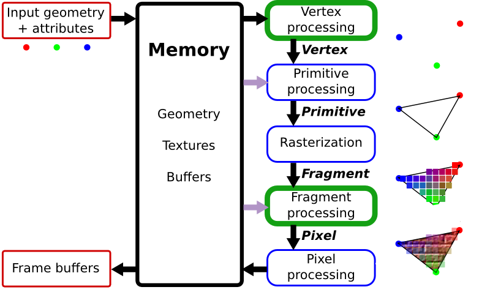
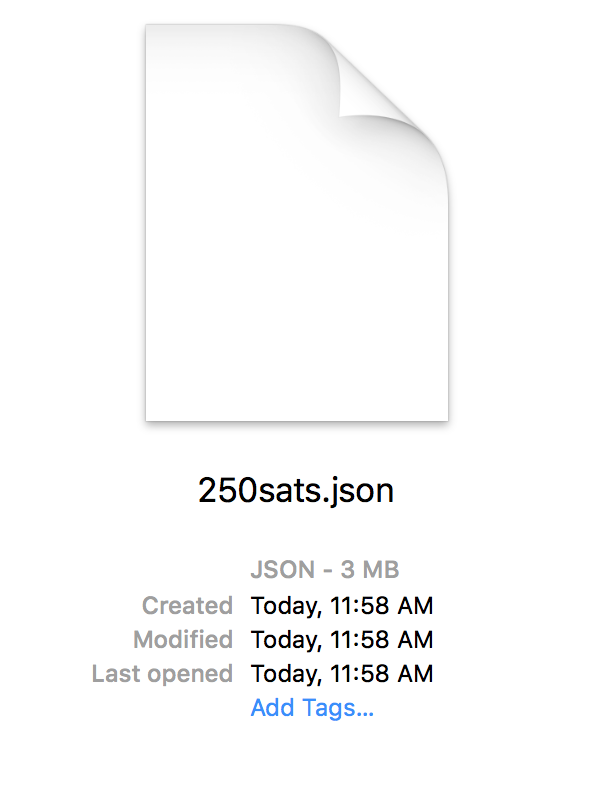
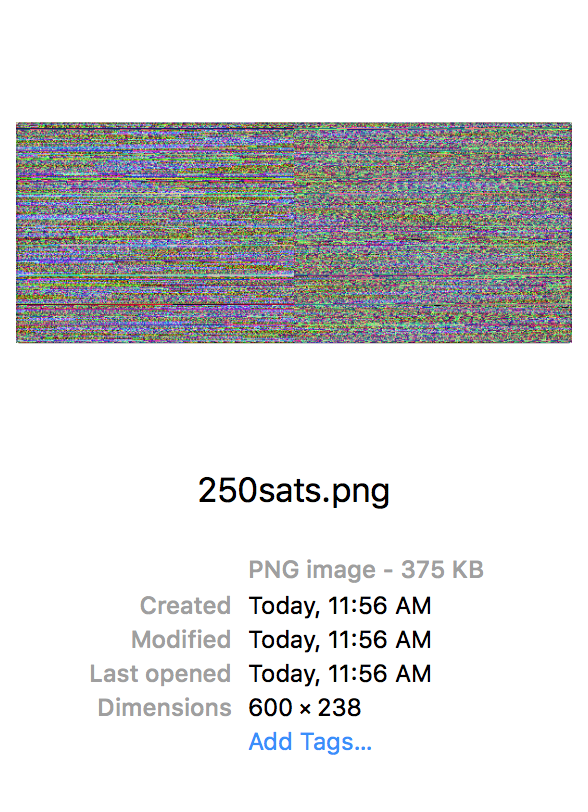
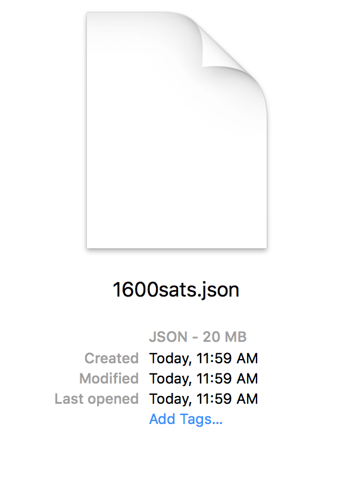
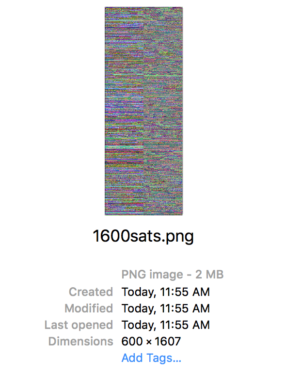

CPU **>** GPU Memory **>** Render Pipeline **>** Screen

Note:
So let's get serious and speak about cost. Let's have an adult conversation about efficiency...
WebGL render stuff fast. Why? because it is his own processing unit that runs multiple threats in parallel... right?
For that need to manage his own resolrse. Those resorses have to be uploaded in the GPU memory.

What are those resources... esentially geometries and textures

--


Note:
Passing data from the CPU to the GPU is one of the most important the bottle necs of the pipeline.
The more calls you make, the less fast your engine goes. 
- Like an ikea furniture
- 
Imagine it as....
The name of the game is don't disturb the GPU, let it do his game non stop.
For that their resources are separate... 
Think more metaphors

--


Note:
Geometries are points

--


Note:
asociated with color. Those positions get connected in triangles. And their colors interpolated.

--


Note:
Images are apply to the geometry, like fabric to canvas

---

<!-- .slide: data-background="#020303" -->
<iframe class='fit' width="100%" height="100%" style='min-height: 1000px;' data-src="http://patriciogonzalezvivo.github.io/LineOfSight/"></iframe>

[LineOfSight](http://patriciogonzalezvivo.github.io/LineOfSight/)

Note:
When I was making LineOfSight I found my self in the dilema of how to update the position of 1500 moving targets wit precession.

--

  

more than 24fps


Note:
to have something moving smoothly need to generate the illusion of animation... that's 24fps


--

~1500 obj x 24ps = 
**36,000** <!-- {_class="fragment"} -->


calls a second <!-- {_class="fragment"} -->

Note:
so if I want to animate 1500 satellites all at once... I need to update the position of each satellite 24 times a second....
that's is 36000 calls per seconds.... in a browser : /

How did I solve this dilema?

--


Note:
Well, remember that the GPU only thing you can upload to the GPU memory are Geometry and Images.  

--

<!-- .slide: data-background="#2E2A27" -->


Note:
So I can use the Images as the a partiture... like pianola roll  

--


Note:
I can encode the position of moving objects into series of colors, each satellite (which have a geometry... ) will read a different line of this partiture.

--

 

--

 

--

# 10%
<!-- .slide: data-background="#17141B" -->

--

<!-- .slide: data-background="#17141B" -->


Note:
So the next problem to solve was how each satellite know which line to read?

--

<!-- .slide: data-background="#000000" -->


Note:
well... I can also encode in the color of the geometry the number of the row.
I used again color to encode the information from the CPU to GPU

--

```js
  function() {
      var hovered = feature.id === properties.hovered ? 0 : 1;
      return [(Math.floor(feature.id/255))/255, (feature.id%255)/255, hovered ]; 
  }
```

--

```glsl
float getIndex (vec2 encodedIndex) {
    return (encodedIndex.x*65025.+encodedIndex.y*255.)+.5;
}

void main () {
    ...
    float index = getIndex(color.st);
    if (v_color.b < .5) {
        // If is hoover
    }
    ...
}

```

--

<!-- .slide: data-background="#000000" -->


Note:
In the same way stars from far far away

--

<!-- .slide: data-background="#000000" -->


Note:
send us their information of their quimical composition in the light the produce...

---

**~1600** stations  <!-- {_class="fragment"} -->
**x** **40** days  <!-- {_class="fragment"} -->
(**960** hs)  <!-- {_class="fragment"} -->
**=** **1,536,000** samples  <!-- {_class="fragment"} -->

Note:
So I want to show you how eficient this technique can be.
So I start parsin NOAA METAR's for all the US.
That's about 1700 stations that report around every hour.
I have been doing this

--


--

* temperature <!-- {_class="fragment"} -->
(RED) <!-- {_class="fragment"} -->

* wind speed <!-- {_class="fragment"} -->
(GREEN) <!-- {_class="fragment"} -->

* wind direction <!-- {_class="fragment"} --> 
(BLUE) <!-- {_class="fragment"} -->

Note:
For each record I'm only storing temperature, Wind speed and wind direction

--

<!-- .slide: data-background="#A8B3B1" -->
<iframe class='fit' width="100%" height="100%" style='min-height: 1000px;' data-src="http://tangrams.github.io/WeatherOverTime/"></iframe>

---

## Thank you

[patricio.io](http://patricio.io) | [@patriciogv](https://twitter.com/patriciogv)

--

