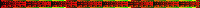

What about **data**?

Note:
Enoght of the styling... 
What about displaying data.

--

<iframe class='fit' width="95%" height="100%" style='min-height: 1000px;' data-src="http://tangrams.github.io/OWM/"></iframe>
<!-- .slide: data-background="#AFB1B1" -->

Note:
I prepair a short demo for this conference, hooking up Tangram to OpenWeatherMap.

--

```js
function update() {

    // Get the current boundaries of the displayed area on the map
    var bbox = map.getBounds();

    // Make the URL for OpenWeatherMaps API, asking for all stations inside that area (bounding box)
    var url = 'http://api.openweathermap.org/data/2.5/box/station?cluster=true&cnt=200&format=json&bbox=';
    url += bbox.getNorthWest().lng + ',' +bbox.getNorthWest().lat + ',' + bbox.getSouthEast().lng + ',' + bbox.getSouthEast().lat + ',';
    url += map.getZoom();
    url += '&appid=6b75c0fa496c2aaf62eb52f8bcce7cd8'; // My free API KEY

    // Make the request and wait for the reply
    fetch(url)
        .then(function (response) {
            // Parse it to JSON
            return response.json();
        })
        .then(function(json) {
            // Make a GeoJSON POI for every station
            var features = [];
            for (var i in json.list) {
                features.push(makePOIs(json.list[i]));
            }
            // Pass the POIs as a GeoJSON FeaturesCollection to tangram
            scene.setDataSource('stations', {type: 'GeoJSON', data: {
                'type': 'FeatureCollection',
                'features': features
            }});
        })
        .catch(function(error) {
            console.log('Error parsing the JSON from OpenWeatherMaps.', error)
        })
}
```

Note:
This is run every time the map stop moving it trigged a debounced event that construct a request to the API asking for the stations in that bounding box.
Collect the data and pass it to Tangram as a new source.

--

```js
function makePOIs(station) {
    if (!station.wind) {
        station.wind = {speed: 0, deg: 0};
    }
    return {
            type: 'Feature',
            geometry: {
                type: 'Point',
                coordinates: [station.coord.lon, station.coord.lat]
            },
            properties: {
                name: station.name,
                temp: station.main ? station.main.temp || 0.0 : 0.0,
                pressure: station.main ? station.main.pressure || 0.0 : 0.0,
                humidity: station.main ? station.main.humidity || 0.0 : 0.0,
                w_speed: station.main ? station.wind.speed || 0.0 : 0.0,
                w_deg: station.wind ? station.wind.deg || 0.0 : 0.0, 
                kind: 'station'
            }
        };
}
```

Note:
Each station is parsed in this way to make it look like a GeoJSON Point

--

JSON

```JSON
{
    geometry: {
        coordinates: [ -177.3813, 28.2015],
        type: "Point"
    },
    properties: {
        humidity: 54,
        kind: "station",
        name: "PMDY",
        pressure: 1018,
        temp: 14,
        w_deg: 280,
        w_speed: 7.2
    },
    type: "Feature"
}
```

Note:
Ends up looking something like this

--

Scene.yaml

```yaml
layers:
    ...
    station:
      data: { source: stations }
      draw:
          text:
              # Print the temperature (°C) instad of the actual name of the station 
              text_source: |
                  function() {
                      return feature.temp + '°';
                  }
              # Suspend label collisions and repetition checking
              collide: false
              repeat_distance: 0px
              # Show over all
              blend: overlay
              blend_order: 0
              offset: [0,-30px]
              font:
                  size: 20px
                  fill: black
                  stroke: { color: white, width: 5 }
          wind:
              blend: overlay
              blend_order: 1
              size: function() { return 20. + Math.pow(feature.w_speed, 0.5) * 20.; }
              color: |
                  function() {
                      return [ parseFloat(feature.temp)+127, feature.humidity, (feature.w_deg/360)*255 ];
                  }
```

Note:
In Tangram this data source filtered. 
We will display a label with the temperature.
And for the wind we will use a shader... but in order to pass the data to the shader we have to encode it into something that the shader can read...

--


Note:
This is not a trivil detail. Passing data from the CPU to the GPU is one of the most important the bottle necs of the pipeline.
So how to do it?

--

<!-- .slide: data-background="#000000" -->


Note:
The answer is COLORS!
The geometry of that makes the point of each station can get an unique color. Is part of the engine to style a map

--

<!-- .slide: data-background="#000000" -->


Note:
As Stellar Spectra... we can transport data using colors

--

```js
    color: |
        function() {
            return [ parseFloat(feature.temp)+127, feature.humidity, (feature.w_deg/360)*255 ];
        }
```

Note:
the humidity in the GREEN channel
and the wind degree into the BLUE channel.
We also are using a little of JS to change the size of this arrow based on the wind speed

--

GLSL Block on the style

```yaml
  wind:
    base: points
    texcoords: true
    animated: true
    mix: [functions-aastep, geometry-matrices]
    shaders: 
        blocks: 
            global: |
                float shape(vec2 st, int N){
                    st = st * 2.0 - 1.0;
                    float a = atan(st.x,st.y)+PI;
                    float r = TWO_PI / float(N);
                    return cos(floor(.5 + a / r) * r - a) * length(st);
                }
            color: |
                float temp = 0.5 + color.r * 0.5;
                float humidity = color.g;
                float w_deg = color.b * PI;

                // Ignore wind blowing at 0.0 degrees. Probably is an error
                if (w_deg != 0.0) {
                    vec2 st = v_texcoord.xy;
                    st -= .5;
                    st = rotate2D(w_deg) * st;
                    st *= .62;
                    st += .5;
                    float d = min(shape(st*vec2(1.5,1.) + vec2(-0.250, -0.07), 3), shape(st * vec2(2.,1.) + vec2(-0.500, 0.100), 4));
                    color = mix(vec4(1., 0.,0.,1.), vec4(0., 0., 1., 1.),temp*4.-2.5) * vec4( 1.0 - step(.2, d));
                } else {
                    color.a = 0.0;
                }
```

Note:
Wind is going to be a special style. Below you can see the shader block we are making for it.
So we grab the values encoded into colors and and construct an arrow, which we will rotate and tint using the angle and temperature.

--

<!-- .slide: data-background="#36383C" -->
<iframe class='fit' width="100%" height="100%" style='min-height: 1000px;' data-src="http://editor.thebookofshaders.com/?log=160307211846"></iframe>

Note:
This is that shader block in a shader by it own.

--

<!-- .slide: data-background="#AFB1B1" -->
<iframe class='fit' width="95%" height="100%" style='min-height: 1000px;' data-src="http://tangrams.github.io/OWM/"></iframe>

[Tangram & OWM](http://tangrams.github.io/OWM/)

Note:
The over all result

---

<!-- .slide: data-background="#020303" -->
<iframe class='fit' width="95%" height="100%" style='min-height: 1000px;' data-src="http://patriciogonzalezvivo.github.io/LineOfSight/"></iframe>

[LineOfSight](http://patriciogonzalezvivo.github.io/LineOfSight/)

Note:
A more extreme case of this tecnique is this project that I made call Line of Sigth
Here the problem is not how to pass data to the Shader but that the data is constatly moving... and... is over 15 handres of them!
Also the position have to be accuratly.

--


Note:
The solution was to pass an array of arrays of colors... which is actually a picture :)

---

```js
var data = new Data2Image();
var instances = 200;
data.setTotalInstances(instances);
data.addElement('negative_integerx100','number', (instance, element) => {
    return -instance*100;
});
data.addElement('negative_integerx10','number', (instance, element) => {
    return -instance*10;
});
data.addElement('negative_integer','number', (instance, element) => {
    return -instance;
});
data.addElement('float','number', (instance, element) => {
    return instance/instances;
});
data.addElement('integer','number', (instance, element) => {
    return instance;
});
data.addElement('integerx5','number', (instance, element) => {
    return instance*5;
});
data.addElement('integerx10','number', (instance, element) => {
    return instance*10;
});
data.addElement('integerx100','number', (instance, element) => {
    return instance*100;
});

// Get the URL of the image
var url = data.getUrl();
// or a DOM with the image preloaded
var img = data.getImg();
```

[Data2Image](http://tangrams.github.io/data2image/)

Note:
I got very excited with the posibilities of this technique that I start working on a generalize javascript library to convert data to images in a simple way.
For example this lines will produce an image that look like this

--



Note:
If decode the data in a shader we can have back the values

--


--

<!-- .slide: data-background="#36383C" -->
<iframe class='fit' width="100%" height="100%" style='min-height: 1000px;' data-src="http://tangrams.github.io/data2image/timeline-editor.html"></iframe>

Note:
More interestinly for my was to be able to make compositions. Patterns that scape an algorithmic approach

---

## Thank you

@patriciogv
