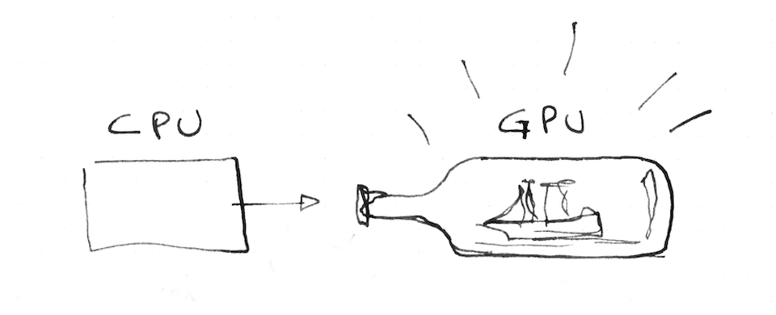
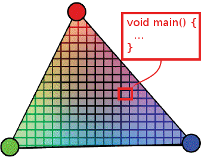
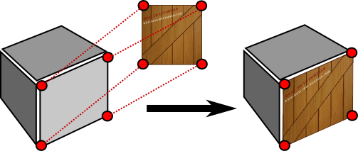
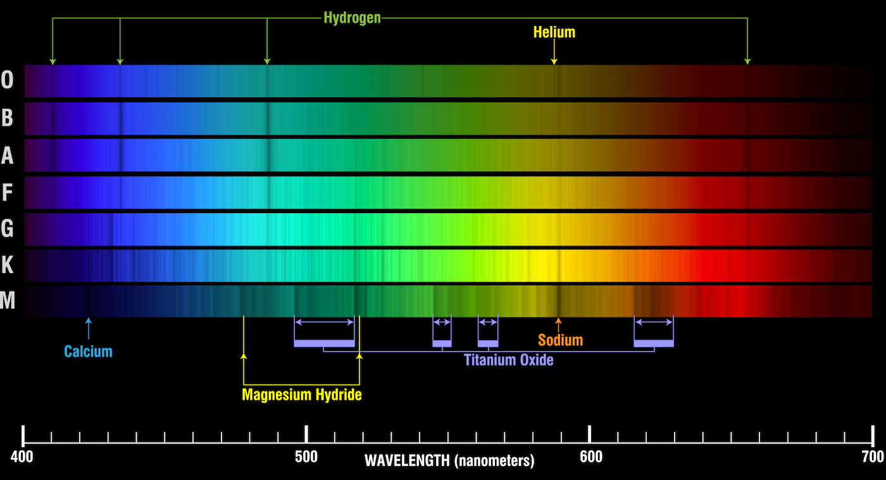

Note:
So let's get serious and speak about cost. Let's have an adult conversation about efficiency...

Passing data from the CPU to the GPU is one of the most important the bottle necs of the pipeline.

WebGL render stuff fast. Why? because it is his own processing unit that runs multiple threats in parallel... right?
The more calls you make, the less fast your engine goes.
For that is convenient to have all the resources loaded on the GPU memory before start the job.

What are those resources can be store on the GPU... esentially geometries and textures

Like a ship in a bottle, you don't want to be passing things constantly... you upload your resources and then work inside the bottle.

--



Note:
asociated with color. Those positions get connected in triangles. And their colors interpolated.

--



Note:
Images are apply to the geometry, like fabric to canvas

---

<!-- .slide: data-background="#020303" -->
<iframe class='fit' width="100%" height="100%" style='min-height: 1000px;' data-src="http://patriciogonzalezvivo.github.io/LineOfSight/"></iframe>

[LineOfSight](http://patriciogonzalezvivo.github.io/LineOfSight/)

Note:
When I was making LineOfSight I found my self in the dilema of how to update the position of 1500 moving targets wit precession.

--

  

more than 24fps


Note:
to have something moving smoothly need to generate the illusion of animation... that's 24fps


--

~1500 obj x 24 fps = 
**36,000** <!-- {_class="fragment"} -->


calls a second <!-- {_class="fragment"} -->

Note:
so if I want to animate 1500 satellites all at once... I need to update the position of each satellite 24 times a second....
that's is 36000 calls per seconds.... in a browser : /

How did I solve this dilema?

--


Note:
Well, remember that the GPU only thing you can upload to the GPU memory are Geometry and Images.  

--

<!-- .slide: data-background="#2E2A27" -->


Note:
So I can use the image as a "played piano roll". Each satellite, like a each key on the piano will read one line of the image. But instead of the binarry format of the roll... will look for a position incoded in color.

--


Note:
This is how it looks. Each row contain the future positions of a satellite in the next following hour.
Each pixel is encode a big number with pressition enought to display it in the exact locating it will be.
The first part of the screen are for the longitudes while the second is latitud.
Each satelitte just need to read in the right row at the right offset on time to know their exact location.

--


--


--

# 10%
<!-- .slide: data-background="#17141B" -->

--

<!-- .slide: data-background="#17141B" -->


Note:
So the next problem to solve was how each satellite know which line to read?

--

<!-- .slide: data-background="#000000" -->


Note:
well... I can also encode in the color of the geometry the number of the row.
I used again color to encode the information from the CPU to GPU

--

```js
  function() {
      var hovered = feature.id === properties.hovered ? 0 : 1;
      return [(Math.floor(feature.id/255))/255, (feature.id%255)/255, hovered ]; 
  }
```

--

```glsl
float getIndex (vec2 encodedIndex) {
    return (encodedIndex.x*65025.+encodedIndex.y*255.)+.5;
}

void main () {
    ...
    float index = getIndex(color.st);
    if (v_color.b < .5) {
        // If is hoover
    }
    ...
}

```

--

<!-- .slide: data-background="#000000" -->


Note:
In the same way stars from far far away

--

<!-- .slide: data-background="#000000" -->


Note:
send us their information of their quimical composition in the light the produce...
I hae one more example of this technique that is common on video games, but I'm applying to data visualization on maps...

---

**~1700** stations  <!-- {_class="fragment"} -->
**x** **40** days  <!-- {_class="fragment"} -->
(**960** hs)  <!-- {_class="fragment"} -->
**=** **1,536,000** samples  <!-- {_class="fragment"} -->

Note:
I have been collecting NOAA METAR's for all US weather stations the last weeks.

Every day I have a raspberrypi fetching the last 24 cycles of 1700 stations that report around every hour.
The raspberry pi download the METAR text files from NOAA FTP server and parse it into JSON that store for each day.
Then with another script enconde all those JSON files for each day into a single image.

That's arround a millon an a half samples.

--

* temperature <!-- {_class="fragment"} -->
(RED) <!-- {_class="fragment"} -->

* wind speed <!-- {_class="fragment"} -->
(GREEN) <!-- {_class="fragment"} -->

* wind direction <!-- {_class="fragment"} --> 
(BLUE) <!-- {_class="fragment"} -->

Note:
For each record I'm storing the temperature, Wind speed and wind direction in the RED, GREEN and BLUE channels of a picture.

--


Note:
This is how the image looks

--

<!-- .slide: data-background="#A8B3B1" -->
<iframe class='fit' width="100%" height="100%" style='min-height: 1000px;' data-src="http://tangrams.github.io/WeatherOverTime/"></iframe>

---

[patriciogonzalezvivo.github.io/**openVis16**](http://patriciogonzalezvivo.github.io/openVis16/)

Note:
So here is this presentation.
I'm going to be around the next following days, I will love to talk more about this.
also feel free to DM-me on twitter @patriciogv

--

---

## Thank you

[patricio.io](http://patricio.io) | [@patriciogv](https://twitter.com/patriciogv)

--

