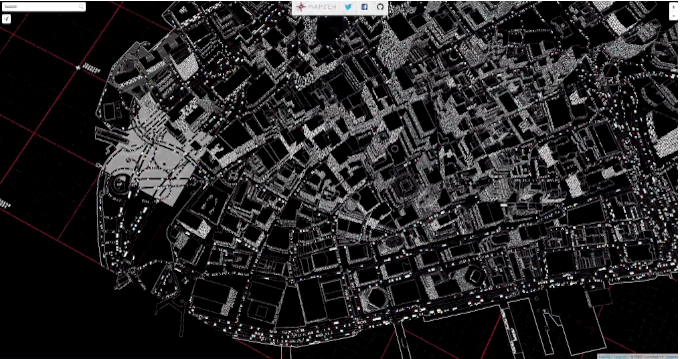
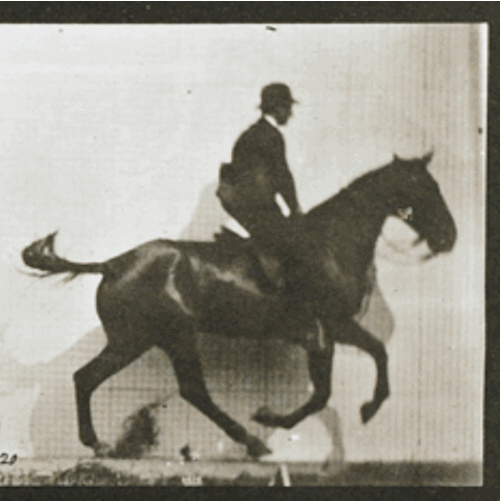

<!-- .slide: data-background="#000000" -->
<span style='font-size: 31px; font-weight: 300; color: white; text-transform: uppercase;'> Enhancing your maps & visualizations with </span>

<span style='font-size: 66px; font-weight: 400; color: white; text-transform: uppercase;'> WebGL GLSL Shaders</span>


<canvas class='sandbox' data-fragment-url='shaders/datastream.frag' width='1000px' height='100px' style='width: 90%; height: 40%; margin: 60px'></canvas>

<span style='font-size: 16px; font-weight: 100; color: white;'> by </span>  <span style='font-weight: 300; color: white;'> Patricio Gonzalez Vivo </span> 

<p style='font-size: 20px; font-weight: 100; color: white; line-height: 1; padding: 0px; margin: 5px; margin-top: 20px;'> patricio.io | @patriciogv </p>
<p style='font-size: 20px; font-weight: 100; color: white; line-height: 1; padding: 0px; margin: 5px;'> mapzen.com | @mapzen </p> 

---

<!-- .slide: data-background="#000000" -->
<iframe class='fit' width='100%' height='100%' style='min-height: 1000px;' data-src='tangram.html?style=randomCity&animate=true#15/40.7076/-74.0146'></iframe> 


Note:
Welcome to an **universe of procedural random**...

Well... the buildings geometry, the roads and the water lines comes from OpenStreetMap... 
Carefully curated and chopped into tiles in Mapzen's servers... 
tessalated and extruded on Tangram... our 2D/3D map engine. 

the rest...

The **grid**, the **numbers**, the **patterns**, the **pulsing tiles**, the **movement of the camera**...
all that is constructed in real time directly by the graphic card of this computer.

The language to program directly on the graphic card is call shaders. A blend of C... with some native mathematical functions. 

---


Patricio Gonzalez Vivo

[patricio.io](http://patricio.io) | [@patriciogv](https://twitter.com/patriciogv)


Note:
My name is Patricio.

--


[**Efecto Mariposa** (Butterfly effect)](http://patriciogonzalezvivo.com/2011/efectomariposa/)

Note:
I'm an artist... 

--


**Flatline**

Note:
...interested in landscape

--

<!-- 

[**Skyline I**](http://patriciogonzalezvivo.com/2014/skylines/skylines.php?v=01) -->


[**Skyline II**](http://patriciogonzalezvivo.com/2014/skylines/skylines.php?v=02)

--


[**Skyline III**](http://patriciogonzalezvivo.com/2014/skylines/skylines.php?v=03)

Note:
width a passion for shaders. 

--

**patricio**.io

Note:
You can find more about them in my site
patricio.io

--

@**patriciogv**

Note:
or follow me at patriciogv

---


[mapzen.com](http://mapzen.com) | [@mapzen](https://twitter.com/mapzen)

Note:
Since almost two years ago, I have the priviledge of be part of an amazing team of profesionals at Mapzen.

--

 

[Experiments on **3D Labels** (C++)](https://vimeo.com/107190391)

Note:
I work as a graphic engineer, pushing the limits of our tools. I have work on experiments like this 3D labels

--

   

[Experiment on LIDAR + SfM + OpenStreetMap (Python/C++)](https://mapzen.com/blog/point-clouds)

Note:
or this experiment about mixing LIDAR data with Structure from Motion point clouds from images with openStreetMap data.

--

 

 

[Tangram styles (WebGL)](patriciogonzalezvivo.github.io/tangram-sandbox/)

--

 

 

<!-- .slide: data-background="#000000" -->
[Tangram styles (WebGL)](patriciogonzalezvivo.github.io/tangram-sandbox/)

--

 

 

<!-- .slide: data-background="#000000" -->
[Tangram styles (WebGL)](patriciogonzalezvivo.github.io/tangram-sandbox/)

--

<!-- .slide: data-background="#020513" -->
 

[ISS from OSM](http://patriciogonzalezvivo.github.io/ISS/)

--

<!-- .slide: data-background="#020303" -->


  

[Line of Sight](http://patriciogonzalezvivo.github.io/LineOfSight/)

--


Terrarium experiments

--


Terrarium experiments

--

**mapzen**.com

Note:
You can find more about Mapzen in mapzen.com
All our work is 100% open source and all our services are free. So sign up for API keys, we will be glad to help and assist you on using them.

--

@**mapzen**

Note:
also you can follow us at @mapzen
So... all that maps that I just show are made with shaders.

--

# I ♥ 

##GLSL

Note:
All this work that I show have one or another way shaders
I love them

---


What's a **shader?**

Note:
but... What's a shader?

--

---

<iframe class='fit' width='100%' height='800px' data-src='http://thebookofshaders.com'></iframe>

Note:
One year ago I start a long time project call The book of shaders, my goal with it is to explain what shader are and how they work.
I'm going to use some of the **material** I use in the book to explain what they are but I highly encorage everybody interested on this subject to take a look to it.

--

---

```glsl
uniform vec2 u_resolution;
uniform vec2 u_mouse;
uniform float u_time;

void main() {
    vec2 st = gl_FragCoord.xy/u_resolution.xy;
    st.x *= u_resolution.x/u_resolution.y;

    st += vec2(.0);
    vec3 color = vec3(1.);
    color = vec3(st.x,st.y,abs(sin(u_time)));

    gl_FragColor = vec4(color,1.0);
}
```

Note:
Shaders are small “C-like” programs that **executed a main single function in parallel**. Most of the cases they **compute single operations like position of vertices or the color of a pixel**.

--


Note:
Shaders are for graphic developer, what the **Gutenberg Press** was for books authors.

--


Note:
They free us from the **single threated hand of the CPU** with the **multiple parallel process** to do one frame per cycle.
Let's picture it like this...

--


**CPU**

Note:
Imagine this is your CPU. It's preatty great to do all sort of things. Excecutes complex task one after the other one.
But what about a huge stream of very tiny tinsy small task... for example computing information to display in the screen.
It need to calculate every single pixels of it 

--

800x600 px = 
**480,000** <!-- {_class="fragment"} -->

at 60 mHz <!-- {_class="fragment"} -->
is **28,800,000** <!-- {_class="fragment"} -->

calculations per second <!-- {_class="fragment"} -->

--

2560x1600 px = 
**4,096,000** <!-- {_class="fragment"} -->

at 60 mHz <!-- {_class="fragment"} -->
is **245,760,000** <!-- {_class="fragment"} -->

calculations per second <!-- {_class="fragment"} -->

--


sad **CPU**

Note:
So... this is obviusly inviable.
Closely 16 year ago graphic engeneers find a salution to this particular problem.
Using parallel procesors. Small procesors...

--


**GPU**

Note:
Little pipes very dummy. One next to each other... working independelty.
Like water in **strainer**... the stream of task pass through them.
To picture in this other way.
Each small tube... is very small procesador. that runs a C-like program

--


Note:
Like an arduino

--


Note:
Well more like handreds of arduinos. 
Well you have to imagine better than that... that's only 72 of them.
Imagine that you can flash them all at once with the same firmware.

--


Note:
Each one of them is connected to a single RGB Led and is responsable of computer the color that LED.

--


<!-- .slide: data-transition="fade" -->
Note:
running in parallel.

--


<!-- .slide: data-transition="fade" -->
Note:
Each one of them responsable for the color of a LED
Imagine the hability to flash them all with a same C program.

--


<!-- .slide: data-transition="fade" -->
Note:
They also have their own memory that all share

--

<!-- .slide: data-transition="fade" -->


Note:
Imagine this happening away from the CPU. In isolation.

We have just imagine the Graphic Computer unit, it's power and some of their limitations. 

---

<!-- .slide: data-background="#36383C" -->
<iframe class='fit' width='100%' height='800px' data-src='editor.html'></iframe>

Note:
This is a single shader. They are atomic and self contain. One **single main function*** execute in parallel for each pixel. Is the Sauron ring of GPUs. 
It have some build in functions like: ```gl_FragCoord``` (read only variable that  provides the position of the pixel on the viewport) and ```gl_FragColor``` (write only variable that contain the color of the pixel);
Then it have some variables that we can 'send' from the CPU that are going to be uniform to all the threats call ```uniforms```. There we are passing the resolution (or dimensions) of the viewport, the mouse position and elipse time. 

---


how to apply **shaders** to a **map**?

Note:
So, how shaders are applied to maps?

--


---

<iframe class='fit' width="100%" height="800px" data-src="tangram.html?style=tiles#2/0/0"></iframe>

Note:
Well in Mapzen we have a webGL engine call Tangram.
It takes vector tiles from OSM data (shout out to OSM contributors)....

---

<iframe class='fit' width="100%" height="100%" style='min-height: 1000px;' data-src="tangram.html?style=tilt-orig#15/40.7076/-74.0146"></iframe>

Note:
extrude them into geometry

---

<!-- .slide: data-background="#000000" -->
<iframe class='fit' width="100%" height="100%" style='min-height: 1000px;' data-src="tangram.html?style=tilt-patterns-orig#15/40.7076/-74.0146"></iframe>

Note:
and pass to the GPU to render to produce maps like the one I show you at the beginning.

---

<!-- .slide: data-background="#1D1D1D" -->
<iframe class='fit' width="100%" height="100%" style='min-height: 1000px;' data-src="tangram.html?style=tilt-gotham-orig#15/40.7076/-74.0146"></iframe>

Note:
and pass to the GPU to render to produce maps like the one I show you at the beginning.

---


<!-- .slide: data-background="#26282C" -->
<iframe class='fit' width="100%" height="100%" style='min-height: 1000px;' data-src="https://mapzen.com/tangram/play/?scene=https://rawgit.com/tangrams/tangram-sandbox/gh-pages/styles/default.yaml"></iframe>

Note:
This is TangramPlay, a tool we made with Lou Huang to live code the scene files we use for tangram.
Lou an amazing UI engineer and have push this into an awesome tool to work with.
You can see is very similar to other style guides, like for tilmil or cartoCSS.

---

How to use **shaders** to display **data** on a map?

--


Note:
So let's get serious and speak about cost. Let's have an adult conversation about efficiency...

Passing data from the CPU to the GPU is one of the most important the bottle necs of the pipeline.

WebGL render stuff fast. Why? because it is his own processing unit that runs multiple threats in parallel... right?
The more calls you make, the less fast your engine goes.
For that is convenient to have all the resources loaded on the GPU memory before start the job.

What are those resources can be store on the GPU... esentially geometries and textures

Like a ship in a bottle, you don't want to be passing things constantly... you upload your resources and then work inside the bottle.

--


Note:
asociated with color. Those positions get connected in triangles. And their colors interpolated.

--


Note:
Images are apply to the geometry, like fabric to canvas

---

<!-- .slide: data-background="#020303" -->
<iframe class='fit' width="100%" height="100%" style='min-height: 1000px;' data-src="http://patriciogonzalezvivo.github.io/LineOfSight/"></iframe>

[LineOfSight](http://patriciogonzalezvivo.github.io/LineOfSight/)

Note:
When I was making LineOfSight I found my self in the dilema of how to update the position of 1500 moving targets wit precession.

--

  

more than 24fps


Note:
to have something moving smoothly need to generate the illusion of animation... that's 24fps


--

~1500 obj x 24 fps = 
**36,000** <!-- {_class="fragment"} -->


calls a second <!-- {_class="fragment"} -->

Note:
so if I want to animate 1500 satellites all at once... I need to update the position of each satellite 24 times a second....
that's is 36000 calls per seconds.... in a browser : /

How did I solve this dilema?

--


Note:
Well, remember that the GPU only thing you can upload to the GPU memory are Geometry and Images.  

--

<!-- .slide: data-background="#2E2A27" -->


Note:
So I can use the image as a "played piano roll". Each satellite, like a each key on the piano will read one line of the image. But instead of the binarry format of the roll... will look for a position incoded in color.

--


Note:
This is how it looks. Each row contain the future positions of a satellite in the next following hour.
Each pixel is encode a big number with pressition enought to display it in the exact locating it will be.
The first part of the screen are for the longitudes while the second is latitud.
Each satelitte just need to read in the right row at the right offset on time to know their exact location.

--


--

# 10%
<!-- .slide: data-background="#17141B" -->

--

<!-- .slide: data-background="#17141B" -->


Note:
So the next problem to solve was how each satellite know which line to read?

--

<!-- .slide: data-background="#000000" -->


Note:
well... I can also encode in the color of the geometry the number of the row.
I used again color to encode the information from the CPU to GPU

--

```js
  function() {
      var hovered = feature.id === properties.hovered ? 0 : 1;
      return [(Math.floor(feature.id/255))/255, (feature.id%255)/255, hovered ]; 
  }
```

--

```glsl
float getIndex (vec2 encodedIndex) {
    return (encodedIndex.x*65025.+encodedIndex.y*255.)+.5;
}

void main () {
    ...
    float index = getIndex(color.st);
    if (v_color.b < .5) {
        // If is hoover
    }
    ...
}

```

--

<!-- .slide: data-background="#000000" -->


Note:
In the same way stars from far far away

--

<!-- .slide: data-background="#000000" -->


Note:
send us their information of their quimical composition in the light the produce...
I hae one more example of this technique that is common on video games, but I'm applying to data visualization on maps...

---

**~1700** stations  <!-- {_class="fragment"} -->
**x** **40** days  <!-- {_class="fragment"} -->
(**960** hs)  <!-- {_class="fragment"} -->
**=** **1,536,000** samples  <!-- {_class="fragment"} -->

Note:
I have been collecting NOAA METAR's for all US weather stations the last weeks.

Every day I have a raspberrypi fetching the last 24 cycles of 1700 stations that report around every hour.
The raspberry pi download the METAR text files from NOAA FTP server and parse it into JSON that store for each day.
Then with another script enconde all those JSON files for each day into a single image.

That's arround a millon an a half samples.

--

* temperature <!-- {_class="fragment"} -->
(RED) <!-- {_class="fragment"} -->

* wind speed <!-- {_class="fragment"} -->
(GREEN) <!-- {_class="fragment"} -->

* wind direction <!-- {_class="fragment"} --> 
(BLUE) <!-- {_class="fragment"} -->

Note:
For each record I'm storing the temperature, Wind speed and wind direction in the RED, GREEN and BLUE channels of a picture.

--


Note:
This is how the image looks

--

<!-- .slide: data-background="#EEEFF2" -->
<iframe class='fit' width="100%" height="100%" style='min-height: 600px; height: 100%;' data-src="http://tangrams.github.io/WeatherOverTime/"></iframe>

---

[patriciogonzalezvivo.github.io/**openVis16**](http://patriciogonzalezvivo.github.io/openVis16/)

Note:
So here is this presentation.
I'm going to be around the next following days, I will love to talk more about this.
also feel free to DM-me on twitter @patriciogv

--

---

## Thank you

[patricio.io](http://patricio.io) | [@patriciogv](https://twitter.com/patriciogv)

--

